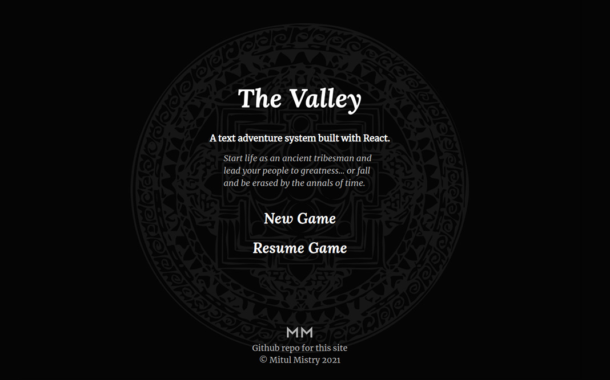

# The Valley

### A text adventure system using [React](https://github.com/facebook/react) and [Redux](https://github.com/reduxjs/react-redux).

The Valley is a JavaScript based system for loading, playing, and managing non-linear text adventures. It allows for branching paths based on the player's choices and keeps track of progress and past decisions.

<!-- ## Demo App
Sample application deployed on Heroku: https://the-valley.herokuapp.com/ -->

## Features
- Non-linear branching paths: Progress along a variety of storylines that change and react.
- Player tracking: Keeps a record of choices made and makes data available to affect future decisions and open or close branching storylines.
- Load stories through JSON: Uses static JSON files to load the stories and player choices along with associated variables. Stories can be created in spreadsheets/CSV files, but must be manually converted to JSON using some external tool before loading in the application.

## Application Info
The project is set up with [Create React App](https://github.com/facebook/create-react-app). It is configured with [Node Package Manager](https://www.npmjs.com/), [Webpack](https://webpack.js.org/), and [Babel](https://babeljs.io/).

The application uses [React](https://reactjs.org/) for the front-end to render data to the browser. This allows updates to the state (including updating text and displaying new choices) to be done automatically. Data is managed by [Redux](https://redux.js.org/) and kept in the [store](../master/src/store/store.js).

## Redux
Data for the application is centralized in the Redux [store](../master/src/store/store.js). It is initialized in the [index.js](../master/src/index.js) file and exported for use in the game system classes. The store is updated using [actions](../master/src/actions) sent to [reducers](../master/src/reducers) which return new versions of the state. 

The store saves the state to the browser storage and loads from there when visiting the application again (or refreshing). For making changes or troubleshooting, try clearing the browser history before reloading the application to start with a fresh state.

## Project Structure
### Initiation
The game initiates through [index.html](../master/public/index.html) and loads scripts through [index.js](../master/src/index.js), as well as sets up the Redux store. If deployed to a webhost, the game initiates through [server.js](../master/server.js). The main React component structure is rendered through [App.js](../master/src/App.js), which determines which components to render based on the route (using [React Router](https://reactrouter.com/)).

### [Components](../master/src/components)
React components reside under this directory and are used to form the front-end for the application. Containers are used to connect to the Redux store using [React-Redux](https://react-redux.js.org/).

### [Mechanics](../master/src/mechanics)
The game uses class based systems to load text and manage the game state.
- The [TextManager](../master/src/mechanics/TextManager.js) class is used to load and structure the JSON files under [story modules](../master/src/storyModules). These are the files that contain all the story text, choices, and associated data for each story node.
- The [GameManager](../master/src/mechanics/GameManager.js) class forms the heart of the application and processes game events. It uses various methods to calculate the next story node destination based on current location in the narrative as well as other variables (including past decisions). It is interfaced primarily through the loadGame() and makeDecision() methods. These methods will respectively load text and choices based on the player's current location and calculate the next detination based on the choice that was made. The class interfaces with the Redux store directly, reading and updating data as needed.

## How the Application Works
The game aims to allow the development of complex, non-linear stories that can be developed in a spreadsheet rather than hard coded. The player can start a new game from a blank state, read text in a story node, then make a decision on how they want to proceed based on the available choices associated with that story node. The game will keep track of player decisions and add points (such as karma, intellect, etc.) that can then unlock future choices. Destinations will at times be calculated based on percentages, so not all choices will lead to the same results. In this way, the player can navigate their way through a unique narrative.

A story node consists of a uniquely identifiable key and text. Each story node has one or more choices, each with data associated with them (such as destinations, and probabilities for each). Making a choice might have a 60% chance of leading to destination A and 40% chance of leading to destination B, and this system allows this level of granularity. A choice may also give the player points (such as karma for making a selfless decision) and may require the player to have certain points (cost) in order to be available. In addition, a choice may require the player to have made certain decisions in the past, and the system allows for this as well.

During the course of the narrative, there are times when the system checks for certain past decisions and does so through what's referred to as link nodes. Link nodes have checks for specific variables, or even combinations of variables (using operators like && or ||), and they can be checked against player data in the Redux store.

All this gameplay processing is done in the [GameManager](../master/src/mechanics/GameManager.js) class, which has direct access to the Redux store to read player data and make changes.

## Commands
`npm run start` - Starts the development server.

`npm run build` - Bundles the app into static files for production.

`npm run eject` - Removes Create React App and copies build dependencies, configuration files and scripts into the app directory. If you do this, you can’t go back!

## Install Instructions
Node Package Manager (NPM) is used for dependencies. To install the application locally, follow these instructions:

1. Install [Node.js](https://nodejs.org/). NPM comes packaged with it.
2. Run `npm install` in the command line while in the project directory. It will install dependencies from the [package.json file](../master/package.json).
3. To build for development and run the local dev server at http://localhost:3000, run `npm run start`.

<!-- For production, if deploying to Heroku, set the config variable `NPM_CONFIG_PRODUCTION` to `false` so it properly installs Webpack before building the application. -->

## Licence
This project is open source under the terms of the [MIT License](http://opensource.org/licenses/MIT).
